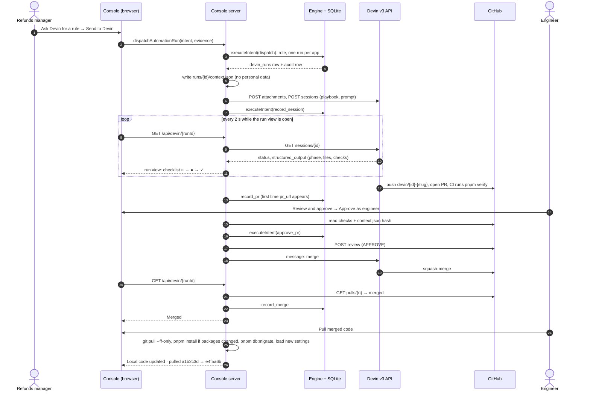

# Operations Console with Devin

An internal operations console for a regulated fintech, where business rules, checks and whole
apps change through one-sentence requests that Devin turns into reviewed pull requests, without
anyone hand-editing code. It is a Next.js 15 / React 19 app styled with Tailwind CSS 4 and shadcn/ui,
backed by SQLite, and it drives Devin through the Devin v3 API and GitHub's REST API from the server.

The console runs three live apps (KYC review, Refunds and Feature flags) on one shared engine, and
lists seventeen more as **Coming soon**. The same engine lets the team keep adding to it after
launch. Devin handles three kinds of work, each started from the screen that shows the need:

1. **Rules.** Add a rule from the pattern that needs it, switch it off in seconds, and take it out
   of the code later.
2. **Checks.** Replace a lookup analysts do by hand with one that runs from the case.
3. **Apps.** Start moving the next Power App into the console, as a first pull request plus a list
   of what's left.

---

## Contents

- [Features](#features)
- [Architecture](#architecture)
- [Project structure](#project-structure)
- [Installation](#installation)
- [Usage](#usage)
- [Technical details](#technical-details)
- [Freshness guarantees](#freshness-guarantees)
- [Troubleshooting](#troubleshooting)
- [Development](#development)
- [Documentation index](#documentation-index)

---

## Features

### Managed apps and records

| Area | Count | Examples |
|---|---|---|
| Live apps | 3 | **KYC review** (104 cases), **Refunds** (14 requests), **Feature flags** (11 flags) |
| Coming soon apps | 17 | Chargebacks, Transaction monitoring, Sanctions screening, Wire release, Pricing |
| App areas | 4 | Compliance, Money movement, Customers, Platform |
| Policy rules | Per app | `amount_approval`, `goodwill_approval`, `declared_vs_found`, `production_enable`, `rollout_increase` |
| Live settings | Per app | `refunds.manager_approval_usd_minor` ($500), `kyc.manager_review_score` (70), `flags.rollout_step_needs_manager_percent` (25) |
| Roles | 5 switchable | Refunds agent, Refunds manager, KYC reviewer, Admin, Engineer |
| Devin briefs | 3 | Refund clustering hold, Companies House check, Chargebacks from Power Apps |

Every app, live or not, gets seven controls from the engine the moment it is registered: role
access, a policy check on every action, approvals, live settings, protection against double
submits, masked personal data and one audit log.

### Console capabilities

- **Queues and record views.** Filter, sort and page each app's queue, then open a record with
  masked personal data and an action panel that previews which rules will apply.
- **Approval inbox.** Actions above a limit wait for a manager in `/inbox`. Nobody can approve their
  own request, and approvals are scoped to the app's domain.
- **Live policy settings.** Admins change limits on `/admin/policy`. The next decision uses the new
  value, with no deploy.
- **Devin window.** A side panel that shows what Devin will receive, sends the request, and then
  shows the run live: plan, files changed, checks and pull request.
- **Real-time run progress.** The run view polls every 2 seconds and moves a checklist
  (`○ → ● → ✓`) only when Devin reports progress.
- **Pull request detection.** The console notices when Devin opens a pull request and when it
  merges, and records both without anyone pasting a link.
- **Engineer approval.** **Review and approve** opens a dialog with the CI checks, the reviewer's
  checklist and a context check. Approving posts a GitHub review and tells Devin to merge.
- **Merge sync.** After a merge an engineer clicks **Pull merged code**. The console pulls the code
  into its own checkout, installs dependencies if packages changed, migrates its database and loads
  new settings, so the change is live without a restart.
- **Audit log.** `/audit` lists every action, approval, setting change and Devin run, with the rule
  outcomes and before/after values.
- **Run history and undo.** `/runs` lists every Devin run. A merged change carries **Undo this
  change**, which asks Devin to remove it from the code as it is now.
- **Backups without copies.** Git holds every version. Each run commits `runs/<run_id>/context.json`
  and `plan.json`, so the request and plan behind every change stay in the repository.

---

## Architecture

### System overview

```
                 Refunds agent · Refunds manager · KYC reviewer · Admin · Engineer
                                            │  "Viewing as" (signed cookie)
                                            ▼
┌─────────────────────────────────────────────────────────────────────────────────────────┐
│  CONSOLE  (apps/console · Next.js 15, React 19)                           localhost:3001  │
│                                                                                         │
│   Home  ·  /t/<app> queues  ·  /t/<app>/<id> records  ·  /inbox  ·  /audit              │
│   /admin/policy  ·  /runs  ·  /roadmap/<app>  ·  Devin window                           │
│                                                                                         │
│   Server actions ─────────────────┐          API routes (server only)                   │
│   submitIntent, approveRequest,   │          GET  /api/devin/status                     │
│   updateConstant, dispatch…       │          GET  /api/devin/<runId>   poll + observe   │
│                                   │          POST /api/devin/<runId>   reply to Devin   │
└───────────────────────────────────┼──────────────────────────┬──────────────────────────┘
                                    ▼                          │ bridge (tools/automation)
┌───────────────────────────────────────────────────┐          │ keys read from .env
│  ENGINE  (packages/engine)                        │          │
│  validate → idempotency → policy → approval →     │          ├───────▶ Devin v3 API
│  effect → audit        one SQLite transaction     │          │         sessions, messages
│                                                   │          │
│  SQLite  apps/console/data/console.db             │          ├───────▶ GitHub REST API
└───────────────────────────▲───────────────────────┘          │         PR status, checks, review
                            │ install · migrate · settings     │
┌───────────────────────────┴───────────────────────┐          │
│  SOURCE CODE  (git)                               │◀─────────┘ git pull --ff-only
│  tools/<app>  ·  registry.ts  ·  tests  ·  runs/  │◀──────────── Devin merges an approved PR
└───────────────────────────────────────────────────┘
```

Three rules hold the layers apart:

- **Only the engine writes data.** Every write, whether a refund, a KYC decision, a flag change or a
  Devin request, goes through `executeIntent`. `pnpm check:boundaries` fails the build if anything
  else imports the write handle.
- **The engine names no app.** An app is a folder under `tools/` plus one line in
  `apps/console/src/registry.ts`, so Devin can add or remove one without touching the engine.
- **Code changes only through a reviewed merge.** Devin never touches the live database. After a
  merge, the console pulls the code, installs, migrates and loads new settings itself.

### How roles and apps work together

Each role works its own queue, and the engine carries work across apps and across people:

```
 Refunds agent ──sends refund──▶ Refunds ──over the limit──▶ Inbox ──▶ Refunds manager approves
                                   │
                                   │ same customer (email)
                                   ▼
 KYC reviewer ──approves case──▶ KYC review ──linked refund held──▶ Inbox ──▶ KYC manager approves

 Refunds manager ──"Ask Devin for a rule"──▶ Devin ──PR──▶ Engineer approves ──▶ Devin merges
 Admin ──────────── switches a rule off on /admin/policy ─────▶ next decision uses it, no code change
 Any manager ────── disables a production flag ──────────────▶ applies at once, audited
```

| Role | Works in | Can ask Devin for | Approves |
|---|---|---|---|
| **Refunds agent** | Refunds queue | Nothing | Nothing |
| **Refunds manager** | Refunds, inbox, flags | A refunds rule | Refunds over the manager limit, flag changes |
| **KYC reviewer** | KYC review | Nothing | Nothing |
| **Admin** | Everything, `/admin/policy` | Any change, an undo, a new app | Admin-tier requests, permission flags |
| **Engineer** | `/runs`, run views, audit | Nothing | Devin's pull requests, never ops requests |

A sixth role, `kyc_manager`, exists in the engine and tests but isn't in the switcher. Roles are
checked on the server: a refunds agent who posts a KYC action is refused by the engine, not by the
page.

### The Devin loop, end to end



Deeper diagrams live in [`docs/ARCHITECTURE_DIAGRAM.md`](docs/ARCHITECTURE_DIAGRAM.md), including
a map from what operators see to the code Devin changes.

---

## Project structure

```
fintech-internal-tools/
├── apps/
│   └── console/                     # The Next.js app: routes, server actions, registry, migrations, tests
│       ├── src/
│       │   ├── app/                 # App Router pages and server actions
│       │   │   ├── page.tsx         # Home: queue counts, approvals, recent activity, every app tile
│       │   │   ├── t/[tool]/        # Each app's queue (/t/refunds) and record view (/t/refunds/<id>)
│       │   │   ├── inbox/           # Approval inbox for managers and admins
│       │   │   ├── audit/           # Audit log with filters, rule outcomes and before/after
│       │   │   ├── admin/policy/    # Live policy settings (admin)
│       │   │   ├── runs/            # Every Devin run; Undo this change; Reconcile
│       │   │   ├── roadmap/[mode]/  # Coming soon page for an app not built yet
│       │   │   ├── apps/            # The Apps table
│       │   │   ├── api/devin/       # status/ and [runId]/ routes: the browser's only door to Devin
│       │   │   ├── actions.ts       # Server actions: submit, approve, reject, reveal, settings, role
│       │   │   └── automation-actions.ts  # Server actions: dispatch, approve PR, check merge, sync, stop
│       │   ├── components/          # Devin window, handoff panel, run view, approval dialog, queues
│       │   ├── lib/                 # bridge.ts (server deps), devin-route.ts, modes.ts, env.ts
│       │   ├── registry.ts          # The list of live apps; nothing else enumerates tools
│       │   ├── schema.ts            # Re-exports every table for drizzle migrations
│       │   └── instrumentation.ts   # On server start: load .env, register every app's settings
│       ├── drizzle/                 # SQL migrations and journal
│       ├── scripts/                 # migrate.ts, seed.ts, scenario.ts (courier-outage)
│       ├── tests/                   # Vitest: engine, tools, lib, api, scripts
│       └── data/                    # (gitignored) console.db and replays/<run_id>.json
├── tools/                           # One package per app; Devin adds and edits these
│   ├── kyc/                         # KYC review: case file, checks, declared vs found, linked activity
│   ├── refunds/                     # Refunds: rules, merchant clusters, seed
│   ├── flags/                       # Feature flags, including app on/off flags
│   └── automation/                  # Devin runs: specs, bridge, Devin + GitHub clients, run files
├── packages/
│   ├── engine/                      # executeIntent, policy, approvals, idempotency, audit, PII masking
│   ├── permissions/                 # The role catalog
│   ├── ui/                          # shadcn/ui primitives and shared views
│   ├── db/                          # Read client
│   ├── db-write/                    # Write handle (only the engine may depend on it)
│   └── db-core/                     # SQLite connection and engine tables
├── runs/<run_id>/                   # context.json + plan.json per Devin run, merged with its PR
├── fixtures/power-apps/chargebacks/ # The Chargebacks Power Apps export Devin migrates from
├── scripts/
│   ├── check-boundaries.ts          # Engine names no app; only the engine writes
│   ├── run-guard.ts                 # Holds a Devin PR to its committed plan
│   └── register-playbook.ts         # Creates/updates the Devin playbook
├── .devin/run-protocol.playbook.md  # The playbook every Devin run follows
├── .github/workflows/verify.yml     # CI: lint, typecheck, boundaries, tests, run guard
├── docs/                            # Architecture, protocols, specs, demo script
└── .env.example                     # DEVIN_API_KEY, GITHUB_TOKEN and optional overrides
```

### Key files explained

**Console and server**

| File | Role |
|---|---|
| `apps/console/src/app/page.tsx` | Console entry point: home page with queue counts, approvals and every app tile |
| `apps/console/src/registry.ts` | Where live apps are declared. Add a tool here and its Coming soon tile goes live |
| `apps/console/src/lib/modes.ts` | The catalog of all 20 apps (`OPS_MODES`), including those not built yet |
| `apps/console/src/lib/bridge.ts` | Reads `DEVIN_API_KEY` and `GITHUB_TOKEN`, builds the Devin, GitHub and git clients |
| `apps/console/src/lib/devin-route.ts` | Logic behind `/api/devin/<runId>`: poll, record PR, record merge, stop |
| `apps/console/src/instrumentation.ts` | Loads `.env` and registers every app's settings when the server starts |

**Devin automation**

| File | Role |
|---|---|
| `tools/automation/src/specs.ts` | The three briefs: request sentence, allowed files, reviewer checklist |
| `tools/automation/src/index.ts` | The `devin_runs` table's actions: dispatch, record session, record PR, approve PR, record merge, stop |
| `tools/automation/src/bridge.ts` | Dispatch, polling, merge detection, merge sync and reconcile |
| `tools/automation/src/devin-api.ts` | Devin v3 client: `/self`, attachments, sessions, messages, terminate |
| `tools/automation/src/github-api.ts` | GitHub client: pull request, checks, file contents, review |
| `tools/automation/src/run-files.ts` | Schemas for `context.json`, `plan.json` and Devin's progress output |
| `.devin/run-protocol.playbook.md` | Intake → baseline → plan → edit → verify → pull request → merge |
| `scripts/run-guard.ts` | CI check that every changed file was in the plan and the plan stayed in scope |

**Refunds**

| File | Role |
|---|---|
| `tools/refunds/src/index.ts` | Refund actions and rules: `amount_approval`, `goodwill_approval`, `not_disputed` |
| `tools/refunds/src/clusters.ts` | Merchant clusters of `not_received` refunds for the cluster drawer |
| `apps/console/scripts/scenario.ts` | `courier-outage`: 60 Fernhill Home refunds for the switch-off demo |

**KYC**

| File | Role |
|---|---|
| `tools/kyc/src/index.ts` | KYC actions and rules, including `declared_vs_found` and the PEP approval |
| `tools/kyc/src/case-file.ts` | Checks and Declared vs found for each case |
| `tools/kyc/src/linked-activity.ts` | Refunds and other activity linked to a KYC customer |

**Data and backups**

| Path | Role |
|---|---|
| `apps/console/data/console.db` | Live SQLite database. Disposable: rebuild with `pnpm db:setup` |
| `apps/console/data/replays/<run_id>.json` | Local recording of every poll that changed something |
| `runs/<run_id>/` | Committed request and plan for each run. Git is the backup |

---

## Installation

### Prerequisites

- **Node 24** and **pnpm** (CI uses pnpm 12.6.0)
- **git**, with the checkout's `origin` pointing at the GitHub repository
- A **Devin API key** (`cog_…`) from your Devin organisation, for live runs
- A **GitHub token** with pull request read/write on the repository, for **Review and approve**

The console runs without either key. Devin then shows as not connected, and everything else works.

### Steps

1. Clone the repository.

   ```bash
   git clone https://github.com/rmtandon1/fintech-internal-tools.git
   cd fintech-internal-tools
   ```

2. Install dependencies.

   ```bash
   pnpm install
   ```

3. Configure the environment. `.env` sits at the repository root, is gitignored and is read only on
   the server.

   ```bash
   cp .env.example .env
   # then set:
   #   DEVIN_API_KEY=cog_…
   #   GITHUB_TOKEN=ghp_…
   ```

4. Create and seed the database.

   ```bash
   pnpm db:setup        # db:migrate then db:seed → apps/console/data/console.db
   ```

5. Register the Devin playbook (once, and again whenever `.devin/run-protocol.playbook.md` changes).

   ```bash
   pnpm devin:playbook
   ```

6. Start the console.

   ```bash
   pnpm dev             # serves http://localhost:3001 and opens a browser
   ```

7. Check that Devin is connected.

   ```bash
   curl -s localhost:3001/api/devin/status
   # {"github":true,"configured":true,"mode":"live","orgId":"org-…","orgSource":"key",…}
   ```

### Where to look

| URL | What it is |
|---|---|
| `http://localhost:3001/` | Home: queue counts, approvals, recent activity, every app |
| `/t/refunds`, `/t/kyc`, `/t/flags` | The three live apps |
| `/t/<app>/<id>` | A record, with the action panel and its rule preview |
| `/inbox` | Approval inbox (managers, admin) |
| `/audit` | Audit log |
| `/admin/policy` | Live policy settings (admin) |
| `/runs` and `/t/automation/<id>` | Devin runs and each run's view |
| `/roadmap/<app>` | Coming soon page for an app not built yet |
| `/api/devin/status` | Devin mode, organisation and key check (never the key) |
| `https://app.devin.ai/sessions/<id>` | A run's Devin session (**Open in Devin**) |

Install-time problems, with commands to copy, are in [`docs/SETUP.md`](docs/SETUP.md).

---

## Usage

Each workflow below uses the seeded data, so the values match what you'll see. Pick the role in
**Viewing as** at the top of the page before each step. Steps marked *instant* change the screen
at once; steps marked *async* wait on Devin, GitHub and an engineer.

### 1. Add a rule

Four `not_received` refunds from Kestrel Outdoors ($465, $460, $475 and $480) each pass the $500
manager limit alone, and total $1,880 together.

1. As **Refunds agent**, open `/t/refunds`, open `rfnd_0013` and click **Send to processor**.
   It settles. *(instant)* This is the "before".
2. Switch to **Refunds manager**. On `/t/refunds`, open the Kestrel Outdoors cluster in the pattern
   monitor and click **Ask Devin for a rule**.
3. Read **What Devin will see**: the four refunds, the $500 and score-70 limits, and the start
   commit. No names, emails or card numbers.
4. Keep or edit **The request**. The prefilled sentence is:
   > Once a merchant's "not received" refunds add up past the manager limit, send them to a
   > manager for approval. Send those customers' KYC approvals to a manager too.
5. Click **Send to Devin**. The Devin window switches to the run view. *(async, 30–60 minutes)*
   - The engine checks your role and that no other refunds run is in flight, then writes the run
     row and one audit row.
   - The console writes `runs/<run_id>/context.json` and opens a Devin session with it attached.
   - Devin runs `pnpm verify` at the base, then commits `plan.json` listing every file it will
     touch before it edits any of them.
   - Devin writes the rule, a KYC rule, a window setting (`refunds.clustering_window_days`, 14 days,
     0 = off) and tests, and changes the existing test that said all four refunds pass.
   - Devin runs lint, typecheck, the boundary check, the run guard and every test, then opens a
     pull request. The run view shows **PR open #n** within one poll.
6. Switch to **Engineer**, click **Review and approve**, tick through the eight-item checklist and
   click **Approve as engineer**.
   - The console checks CI is green and that `context.json` on the branch matches what it sent.
   - It posts the GitHub review and tells Devin to merge. The run turns **Merged** on the next
     poll once GitHub reports it.
7. Still as **Engineer**, close the dialog and click **Pull merged code** on the run. The toast
   reads `pulled … → …`. Merged isn't the same as on: the console only runs the new code once it
   is pulled into its own checkout.
8. **Verify.** As **Refunds agent**, open `rfnd_0011` ($480) and click **Send to processor**. It
   lands in the manager inbox with the status **Pending manager approval**, and the rule list shows
   `clustering_hold` as **hold**: "Kestrel $1,880 over $500 in 14 days".

### 2. Switch a rule off, and back on

A courier outage sends 60 genuine Fernhill Home refunds to the manager inbox. The rule has to
stop now, without an engineer.

1. Load the scenario: `pnpm db:scenario courier-outage`.
2. As **Refunds manager**, open `/inbox`. Sixty Fernhill Home refunds are waiting.
3. Switch to **Admin**, open `/admin/policy`, set `refunds.clustering_window_days` from `14` to `0`
   and save. *(instant)*
   - The setting change goes through the engine like any other write and adds one audit row with
     the old and new value.
   - Nothing is deployed. The rule reads the setting on every decision.
4. **Verify.** As **Refunds agent**, open `rfnd_0012` and click **Send to processor**. It settles.
   `clustering_hold` still appears in the rule list, answering **allow**: switched off, not removed.
5. To switch it back on, set the window back to `14`. The next Kestrel refund is held again.

### 3. Remove a rule

Risk wants a narrower rule instead, so the old one should leave the code, keeping everything
merged since.

1. As **Admin**, open `/runs`, find the merged Kestrel run and click **Undo this change**.
2. Read **What will be undone**. An undo carries no free text. Click **Ask Devin to undo it**.
   *(async)*
   - Devin starts from `git revert -m 1 <merge commit>` on a fresh branch.
   - Where later work touched the same file (for example a `partial_delivery` reason code in
     `tools/refunds/src/index.ts`), Devin keeps the later work and removes only the rule.
   - Devin removes the rule, the KYC rule, the setting and the eight hold tests, naming each
     removed test in `plan.json`.
   - The pull request lists what code can't undo: held refunds for a person to release, and the
     setting row left in the database.
3. As **Engineer**, click **Review and approve**, then **Approve as engineer**. Once the run shows
   **Merged**, click **Pull merged code**.
4. **Verify.** As **Refunds agent**, send `rfnd_0014`. It settles, and `clustering_hold` no longer
   appears in the rule list. The refund reason dropdown still offers `partial_delivery`.

### 4. Automate a manual check

KYC analysts look up every UK business on Companies House in another tab and type the result in.

1. As **KYC reviewer**, open `/t/kyc/kyc_0104`, Thornbury Couriers Ltd. The Company registry check
   reads "Checked by hand", and **Approve** passes every rule.
2. Switch to **Admin** and click **Ask Devin to add a check**.
3. Read **What Devin will see**: the company name, registration number `09318842` and country.
   Nothing about a person.
4. Click **Send to Devin**. The request asks Devin to read the Companies House API docs on the web
   itself. *(async)*
   - Devin plans five files: `tools/kyc/src/companies-house.ts`, recorded responses, a change to
     `tools/kyc/src/index.ts`, `.env.example` and a test file.
   - It reuses the existing `declared_vs_found` rule to hold approval, instead of adding a rule.
   - Without `COMPANIES_HOUSE_API_KEY` the check uses recorded responses and says "test data".
5. As **Engineer**, approve the pull request, then click **Pull merged code** once it merges.
6. **Verify.** As **KYC reviewer**, back on `kyc_0104`, run the Companies House check. Declared vs
   found gains a material row, "late with its accounts", and **Approve** now needs a KYC manager.

### 5. Start the next app

Chargebacks still runs in a Power App with two Power Automate flows. Its export is in
`fixtures/power-apps/chargebacks/`.

1. As **Admin**, open `/roadmap/chargebacks` and click **Ask Devin to start this app**.
2. Read **What Devin will see**: the seven export files (two screens, two flows, the disputes data).
3. Click **Send to Devin**. *(async)*
   - Devin reads the export's formulas and flows and plans about fifteen files: a new
     `tools/chargebacks/` package, one registry line, a migration, the lockfile, a flag row and tests.
   - It builds the queue from the 50 disputes, turns the hourly deadline email into a count, and
     adds the two riskiest rules (fraud accepts over $500, fights over $2,500).
   - The pull request lists every formula and flow step as done or still to do.
   - The engine owner reviews as well as the engineer, because the change adds a table.
4. As **Engineer**, approve, let Devin merge, then click **Pull merged code**. The pull installs
   the new `@console/tool-chargebacks` package and migrates. The home tile reads **Switched off**,
   and `/t/chargebacks` still sends you to the roadmap page.
5. As **Admin**, open `/t/flags`, find `app.chargebacks` and click **Enable**. *(instant)*
6. **Verify.** The Chargebacks tile goes **Live**. As **Refunds agent**, open `/t/chargebacks`: the
   count reads **3 due within 48 hours**. Click **Accept** on `DSP-20401` ($2,480, fraud). It waits
   for a refunds manager.
7. To take the app off screen again, click **Disable** on `app.chargebacks`. The tile returns to
   **Switched off**; the code and data stay.

### Everyday operations (no Devin)

| Task | Where | Who |
|---|---|---|
| Move a limit, e.g. the refund manager limit from $500 to $750 | `/admin/policy` | Admin |
| Disable a production flag in an incident | `/t/flags` → **Disable** | Any manager |
| Raise a customer-facing rollout by more than 25 points | `/t/flags` → **Set rollout** | Manager, approved by another manager |
| Reveal a masked document number | `/t/kyc/<id>` | KYC manager, admin (writes an audit row) |

---

## Technical details

### Dashboard architecture

- **Next.js 15.5 (App Router)** — routes, React Server Components and server actions. Every page is
  rendered on the server per request (`dynamic = "force-dynamic"` on the root layout).
- **React 19.1** — component UI. Client components only where state lives in the browser: the
  Devin window, the run view's poll loop, dialogs and forms.
- **Tailwind CSS 4 + shadcn/ui on Radix** — styling and accessible primitives, shared through
  `packages/ui`. `tw-animate-css` for motion, `lucide-react` for icons, `sonner` for toasts.
- **SQLite via better-sqlite3 + Drizzle ORM** — one local file, `drizzle-kit` migrations.
- **Zod 4** — every action input, every Devin progress snapshot and every run file is parsed.
- **pnpm workspace** — each app and package is its own package. Workspace packages are compiled by
  Next (`transpilePackages`), with no separate build step. The dependency direction is enforced by
  each `package.json` and by `pnpm check:boundaries`.
- **Vitest** — engine, tools, API route and script tests, with scripted Devin and GitHub clients.

### API and server integration

**Routes the browser calls.** All of them run on the server; no key reaches the browser.

| Endpoint | What it does |
|---|---|
| `GET /api/devin/status` | Whether a Devin key is set, the mode (`live` or `simulation`), the organisation and whether `GITHUB_TOKEN` is set. Checks the key against `GET /v3/self`, cached 60 s (15 s after a failure). Sent with `Cache-Control: no-store`. Never returns the key |
| `GET /api/devin/<runId>` | One poll. Reads the Devin session, records the PR the first time it appears (`record_pr`), checks GitHub for the merge once approved (`record_merge`), stops a run whose session ended (`stop`), and returns the run view payload. 403 for roles outside automation, 404 for an unknown run |
| `POST /api/devin/<runId>` | Sends `{ "message": "…" }` (1–2000 characters) to the Devin session, only while it is waiting for a reply |

**Server actions** (`apps/console/src/app/automation-actions.ts`):

| Action | Button | What it does |
|---|---|---|
| `dispatchAutomationRun` | **Send to Devin**, **Ask Devin to undo it** | Governed `dispatch`, writes `context.json`, opens the session, `record_session` |
| `approveAutomationRun` | **Approve as engineer** | Checks CI and the context hash, `approve_pr`, posts the GitHub review, messages Devin to merge |
| `observeAutomationMerge` | **Check merge** | Asks GitHub whether the PR merged; records and pulls it |
| `syncAutomationRun` | **Pull merged code** | Engineer only. `git pull --ff-only`, `pnpm install --frozen-lockfile` if a package file changed, then `pnpm db:migrate` if migrations are pending |
| `reconcileAutomationRuns` | **Reconcile** | Rechecks every approved run on GitHub and pulls the newest merge |
| `stopAutomationRun` | **Stop run** | Terminates the session and records `stop` with a reason |

**Outbound calls** (all from `tools/automation`, authenticated with server-side keys):

| Service | Calls |
|---|---|
| Devin v3 (`https://api.devin.ai/v3`) | `GET /self` · `POST /organizations/{org}/attachments` · `POST …/sessions` · `GET …/sessions/{id}` · `POST …/sessions/{id}/messages` · `DELETE …/sessions/{id}` |
| GitHub REST | `GET /repos/{o}/{r}/pulls/{n}` · `GET …/commits/{sha}/check-runs` and `/status` · `GET …/contents/runs/<id>/context.json?ref=<head>` · `GET` and `POST …/pulls/{n}/reviews` |
| git + pnpm | `git pull --ff-only origin cognition-dashboard-devin-integration` · `pnpm install --frozen-lockfile` · `pnpm db:migrate` |

### Managed entity schema

An app is a `ToolDeclaration` (`packages/engine/src/types.ts`), declared in `tools/<app>/src/index.ts`
with `defineTool`:

| Field | Meaning |
|---|---|
| `name`, `displayName`, `description`, `icon`, `group` | Identity. `name` matches the catalog entry in `modes.ts` |
| `visibleTo` | Roles that may see the app |
| `fields`, `listColumns`, `filters`, `sections`, `statuses` | How the queue and record view render |
| `actions[]` | `name`, `label`, `allowedRoles`, a Zod `input`, `fromStatus`, `rules[]`, `decide`, `apply` |
| `constants[]` | Live settings: `key`, default `value`, `type`, `description`, `tool` |
| `stats`, `ruleLabels`, `ruleFields` | Queue counts and plain-language rule names |
| `seed` | Idempotent demo data |

A catalog entry (`OpsMode` in `apps/console/src/lib/modes.ts`) carries `id`, `name`, `area`, `roles`,
`columns` for its Coming soon page, and an optional `flag`. An app is **Live** when its tool is
registered and its flag, if it names one, is on; **Switched off** when registered with its flag
off; **Coming soon** otherwise.

A Devin run is a row in `devin_runs`: `id` (ULID), `operation` (`change` or `undo`), `spec`, `tool`,
`intent`, `contextSha256`, `sessionId`, `status`, `prUrl`, `mergeCommit`, `reverses`, `requestedBy`,
`approvedBy`, timestamps and `version`.

### Backup system

The console keeps no copies of source files. Git already holds every version exactly.

- **When:** at dispatch, the console writes `runs/<run_id>/context.json` (the request, allowed
  files, live settings, evidence without personal data, base commit). At Plan, Devin commits it with
  `runs/<run_id>/plan.json` as the branch's first commit.
- **Naming:** `runs/<run_id>/` with a ULID run id; branch `devin/<run_id>-<slug>`; optional tags such
  as `app/chargebacks-built` for a known-good app.
- **Format:** JSON, validated against `ContextFile` and `PlanFile` in `tools/automation/src/run-files.ts`.
  The dispatch audit row stores the SHA-256 of `context.json`, and approval refuses a branch whose
  copy differs.
- **Restoring:** an undo reverts the run's merge commit and resolves conflicts against later work.
  Restoring a removed rule is a new request; the original request and plan are still in `runs/`.
- **The database is disposable.** `rm -rf apps/console/data && pnpm db:setup` rebuilds it. Recorded
  runs worth keeping are copied from `apps/console/data/replays/<run_id>.json` to
  `runs/<run_id>/replay.json` and committed.

### Devin automation workflow

The canonical pipeline. Each phase passes or stops the run; there is no "continue with warnings".

1. **Dispatch** (console). The engine checks the role, that no other run is in flight on the same
   app, and the evidence. It writes the run row and audit row, then the console writes
   `context.json` and opens the session. Nothing is sent without `DEVIN_API_KEY`.
2. **Intake → locate** (Devin). Reads the repository and `context.json`, checks the base commit and
   works out where the behaviour lives. It reads a spec only when the prompt names one.
3. **Baseline.** Runs `pnpm verify` at the base and records the test count per file. Failure: stop,
   no branch.
4. **Plan → backup.** Creates `devin/<run_id>-<slug>` and commits `context.json` + `plan.json` alone,
   listing every file it will touch, the modules it reuses and the tests it will write.
5. **Edit → modify.** Changes only planned files, through the existing intent, approval and audit
   paths. A file outside the plan resets the branch to the plan commit.
6. **Verify → test.** `pnpm verify`: Lint, Typecheck, Boundaries, Run guard, Test. Test counts per file
   may not drop except for tests the plan names. Two fix attempts, then stop.
7. **Pull request → commit + PR.** Pushes the branch and opens a PR with the run, the request, test
   counts before and after, live settings and after-merge steps. CI runs `verify` and the run guard.
8. **Approval** (engineer). Someone who didn't request the run approves in the console. CI must be
   green and `context.json` must match.
9. **Merge.** Devin squash-merges only after the console's message, and reports the merge commit.
10. **Sync → verify.** The console records the merge. An engineer clicks **Pull merged code**, and
    the console pulls, installs if packages changed, migrates and loads new settings. The
    next matching record goes through the new rule.

Every run leaves five audit rows on the normal path: dispatch, session started, PR opened, approved,
merged. The guard checks are named so a PR comment reads as a sentence: **Stays in plan**, **Plan
stays in scope**, **Run dir frozen**, **Shared code reported**, and at approval **Context untouched**.
Full protocol: [`docs/DEVIN_RUN_PROTOCOL.md`](docs/DEVIN_RUN_PROTOCOL.md).

### Workflows at a glance

| Workflow | Starts from | Button | Devin? | Approval |
|---|---|---|---|---|
| Add a rule | Cluster drawer on `/t/refunds` | **Ask Devin for a rule** | Yes | Engineer |
| Switch a rule off | `/admin/policy` | Setting editor | No | Admin only |
| Remove a rule | Merged run in `/runs` | **Undo this change** | Yes | Engineer |
| Automate a check | UK business case on `/t/kyc/<id>` | **Ask Devin to add a check** | Yes | Engineer |
| Start an app | `/roadmap/<app>` | **Ask Devin to start this app** | Yes | Engineer + engine owner |
| Switch an app on | `/t/flags` | **Enable** on `app.<name>` | No | Manager |

---

## Freshness guarantees

Devin changes files the running console loads, so several layers keep the screen from showing stale
state:

| Layer | How it works |
|---|---|
| Server rendering per request | The root layout is `force-dynamic`, so every page reads the database and registry fresh |
| Revalidation after writes | Every server action calls `revalidatePath`, so the page you're on re-renders after a click |
| `no-store` on status | `/api/devin/status` is sent with `Cache-Control: no-store`; both API routes are `force-dynamic` |
| Settings read per decision | Rules read live settings on every decision, so a change on `/admin/policy` applies to the next click |
| Session polling | The run view polls every 2 s and `/runs` every 5 s while a run is in flight, and stops once it ends |
| GitHub polling | Once approved, each poll asks GitHub whether the PR merged; **Check merge** and **Reconcile** do the same on demand |
| Post-merge pull | **Pull merged code**, **Check merge** and **Reconcile** run `git pull --ff-only`. The pull refuses a dirty tree or the wrong branch |
| Dependencies | `pnpm install --frozen-lockfile` runs when the pull changed a `package.json`, `pnpm-lock.yaml` or `pnpm-workspace.yaml`, and retries on the next sync while installed packages lag the lockfile |
| Migrations and settings | `pnpm db:migrate` runs when the journal is ahead of the database; new settings and app flags register without a re-seed or restart |
| Dev server reload | `next dev` picks up pulled source on the next request. A production build must be rebuilt |

The console doesn't use HTML no-cache meta tags or query-string cache busting: pages are server
rendered per request and Next fingerprints its own assets, so neither is needed.

The post-merge rows came out of one diagnosed problem, post-merge deployment drift: see
[docs/POST_MERGE_DEPLOYMENT_DRIFT.md](docs/POST_MERGE_DEPLOYMENT_DRIFT.md).

---

## Troubleshooting

Find the layer first, then the symptom.

```
┌──────────────────────────────────────────────────────────────────────┐
│ 1  BROWSER       Wrong role? Stale tab? Role cookie from before reset? │
├──────────────────────────────────────────────────────────────────────┤
│ 2  CONSOLE       /api/devin/status → mode, orgId, github, error       │
├──────────────────────────────────────────────────────────────────────┤
│ 3  ENGINE / DB   Rule outcome on the record, /audit, pnpm db:setup    │
├──────────────────────────────────────────────────────────────────────┤
│ 4  DEVIN         Open in Devin: waiting for a reply? stopped?         │
├──────────────────────────────────────────────────────────────────────┤
│ 5  GITHUB        PR checks, run-guard comment, token rate limit       │
├──────────────────────────────────────────────────────────────────────┤
│ 6  CHECKOUT      git status clean? on the integration branch? pulled? │
└──────────────────────────────────────────────────────────────────────┘
```

### "Devin isn't connected" in the Devin window

- Check `curl -s localhost:3001/api/devin/status`. `"mode":"simulation"` means no key was found.
- Put `DEVIN_API_KEY=cog_…` in `.env` at the **repository root**, not in `apps/console/`.
- Restart `pnpm dev`. The file is read once per server process.
- A shell `export DEVIN_API_KEY=` (even empty) wins over `.env`; unset it.

### Devin API not working

- Read `error` in `/api/devin/status`. "not scoped to an organisation" means set `DEVIN_ORG_ID`.
- A rejected key is rechecked every 15 seconds; wait, then reload.
- Run `pnpm devin:playbook` if the run ignores the protocol. Devin keeps its old copy until it is
  re-registered.
- Check `DEVIN_API_BASE` isn't pointing at an old proxy.

### Send to Devin is greyed out, or the Ask Devin button is missing

- Check the role in **Viewing as**. Rules need the app's manager or admin; undo and new apps need
  admin.
- Another run on the same app is in flight. Finish or **Stop run** it in `/runs`.
- On a Coming soon page, the button hides once a merged run exists for that app. If the app was
  removed by hand, reset the database so `devin_runs` forgets the old run.
- A KYC reviewer never sees **Ask Devin to add a check**; switch to Admin.

### Run view stuck, checklist not moving

- Click **Open in Devin**. If the session is waiting for a reply, answer in the reply box. An
  unanswered session is suspended for inactivity.
- Wait for the next phase boundary: the checklist moves only when Devin reports, never on a timer.
- Check the Network tab for `/api/devin/<runId>`: 403 means the role can't view runs, 404 an
  unknown run.
- If the session reports but nothing shows, its output doesn't match `StructuredOutput` in
  `tools/automation/src/run-files.ts`.

### Pull request opened but no Review and approve

- Switch to **Engineer**. The requester can never approve their own run.
- Set `GITHUB_TOKEN` in `.env` and restart; `/api/devin/status` should show `"github":true`.
- Wait for CI. Approval is refused until Lint, Typecheck, Boundaries and Test are green.
- "Context untouched" failing means `runs/<id>/context.json` changed on the branch. Stop the run and
  start a new one.

### Dashboard not updating after a merge

- Open the run and click **Pull merged code**, or **Reconcile** on `/runs` as Engineer.
- `git status` in the main checkout must be clean and on `cognition-dashboard-devin-integration`.
  Delete stray `runs/<id>/` folders from stopped runs.
- `Module not found: '@console/tool-…'` means the sync's install didn't finish. Run `pnpm install`,
  then restart `pnpm dev`.
- An app behind a flag reads **Switched off**, and its pages send you to the roadmap, until an admin
  enables `app.<name>` in Feature flags.
- To walk it down layer by layer, from GitHub to the checkout, follow
  [docs/POST_MERGE_DEPLOYMENT_DRIFT.md](docs/POST_MERGE_DEPLOYMENT_DRIFT.md).

### Merge happened on GitHub but the run still says Approved

- Keep the run view or `/runs` open: detection runs only while someone is watching.
- Click **Check merge** on the run.
- The GitHub token may be over its 5,000 requests an hour. Close duplicate tabs showing the same
  run, set `DEVIN_ORG_ID`, and wait for the hour to reset.

### Wrong screens or errors after a database reset

- Pick a role again in **Viewing as**. The reset regenerates the secret that signs the role cookie.
- Stop `pnpm dev` before `rm -rf apps/console/data && pnpm db:setup`, then start it again.
- Reseed within the hour before a demo: seeded dates count from seed time.
- Delete `apps/console/.next` if a route was removed since the last start.

---

## Development

### Scripts

| Script | What it does |
|---|---|
| `pnpm dev` | Next dev server on `:3001`, opens a browser |
| `pnpm build` / `pnpm start` | Production build / serve on `:3001` |
| `pnpm db:setup` | `db:migrate` then `db:seed` (not `pnpm setup`, which pnpm reserves) |
| `pnpm db:migrate` / `pnpm db:seed` | Apply migrations / restore demo records (idempotent) |
| `pnpm db:generate` | Regenerate migrations from `apps/console/src/schema.ts` |
| `pnpm db:scenario courier-outage` | Insert 60 Fernhill Home `not_received` refunds through the engine |
| `pnpm test` / `pnpm test:watch` | Vitest |
| `pnpm lint` / `pnpm typecheck` | ESLint / TypeScript across the workspace |
| `pnpm check:boundaries` | Engine names no app; no relative imports across packages; only the engine writes |
| `pnpm check:run` | Run guard: a Devin PR's diff against its committed plan (no-op on other PRs) |
| `pnpm devin:playbook` | Create or update the Devin playbook from `.devin/run-protocol.playbook.md` |
| `pnpm verify` | Lint + typecheck + boundaries + run guard + tests. CI runs this on every PR |

### Environment variables

| Variable | Required | Purpose |
|---|---|---|
| `DEVIN_API_KEY` | For live runs | The only variable Devin needs. Organisation comes from `GET /v3/self` |
| `GITHUB_TOKEN` | For approval | **Review and approve** and merge detection |
| `DEVIN_ORG_ID` | No | Skip the organisation lookup (halves Devin calls per poll) |
| `DEVIN_PLAYBOOK_ID` | No | Otherwise the playbook titled "Governed console run" is used |
| `COMPANIES_HOUSE_API_KEY` | No | Live Companies House lookups; without it, recorded test data |
| `DEVIN_API_BASE`, `GITHUB_API_BASE` | No | Point at a proxy or test server |
| `GITHUB_REPOSITORY` | No | `owner/repo`, otherwise read from the `origin` remote |
| `SYNC_REMOTE`, `SYNC_BRANCH` | No | Where merge sync pulls from (default `origin`, the integration branch) |

### Running without credentials

- **Devin not connected.** Without `DEVIN_API_KEY` every screen works, the handoff panel shows the
  full request, and **Send to Devin** is disabled. Nothing is written to `devin_runs` or the audit log.
- **Recorded runs.** A run view with no live session replays `runs/<run_id>/replay.json` and labels
  itself **Recorded · replay.json**. Copy a finished run's `apps/console/data/replays/<run_id>.json`
  there and commit it to keep it.
- **Recorded outside data.** Without `COMPANIES_HOUSE_API_KEY`, the Companies House check answers
  from recorded responses and labels its result test data.
- **Tests.** `apps/console/tests/helpers/scripted-clients.ts` and `fake-git.ts` stand in for Devin,
  GitHub and git, so `pnpm test` makes no network calls.

### Contributing

- Branch from `cognition-dashboard-devin-integration` and open PRs against it.
- CI (`.github/workflows/verify.yml`) runs `verify` and the run guard on every PR, and posts the
  guard's report as a comment.
- `runs/` and the guard are under CODEOWNERS. Changes under `packages/engine`, `packages/db*`,
  `packages/permissions` or `apps/console/drizzle` need the engine owner's review.

---

## Documentation index

| Document | What it covers |
|---|---|
| [`docs/SETUP.md`](docs/SETUP.md) | Installation in detail, with fixes for install-time problems |
| [`docs/ARCHITECTURE_DIAGRAM.md`](docs/ARCHITECTURE_DIAGRAM.md) | Layers, the governed write, integrations, workflows, rule lifecycle, screen-to-code map |
| [`CUSTOMER_FRAMING.md`](CUSTOMER_FRAMING.md) | The problem, stakeholders, scenarios and each capability in depth |
| [`docs/DEVIN_RUN_PROTOCOL.md`](docs/DEVIN_RUN_PROTOCOL.md) | Run types, phases, guard checks, undo, approval and merge |
| [`docs/AGENT_TRIGGER_SURFACE.md`](docs/AGENT_TRIGGER_SURFACE.md) | Where requests start, the handoff panel, run view and approval dialog |
| [`docs/REAL_TIME_PROGRESS_READY.md`](docs/REAL_TIME_PROGRESS_READY.md) | How live run progress is polled and drawn |
| [`docs/DEVIN-NO-DEVIN.md`](docs/DEVIN-NO-DEVIN.md) | Which changes need Devin and which are settings |
| [`docs/REFUND_CLUSTERING_HOLD.md`](docs/REFUND_CLUSTERING_HOLD.md) | Brief: the refund clustering hold |
| [`docs/COMPANIES_HOUSE_CHECK.md`](docs/COMPANIES_HOUSE_CHECK.md) | Brief: the Companies House check |
| [`docs/CHARGEBACKS_FROM_POWER_APPS.md`](docs/CHARGEBACKS_FROM_POWER_APPS.md) | Brief: starting the Chargebacks migration |
| [`docs/KYC_CASE_FILE.md`](docs/KYC_CASE_FILE.md) | The KYC case file: checks, declared vs found, PEP approval |
| [`docs/CONSOLE_ROLE_VIEWS.md`](docs/CONSOLE_ROLE_VIEWS.md) | Linked activity on a KYC case and the Devin window controls |
| [`docs/TRANSACTION_INSPECTION.md`](docs/TRANSACTION_INSPECTION.md) | The refunds pattern monitor and cluster drawer |
| [`docs/QUEUE_STATS_STRIP.md`](docs/QUEUE_STATS_STRIP.md) | Queue counts per role |
| [`docs/ACTION_OUTCOME.md`](docs/ACTION_OUTCOME.md) | The panel that shows what happened after an action |
| [`docs/LOOM-VIDEO-SCRIPT.md`](docs/LOOM-VIDEO-SCRIPT.md) | The recorded demo script and recording checklist |
| [`docs/rule-change-workflow.svg`](docs/rule-change-workflow.svg) | How work reaches the console ([editable source](docs/rule-change-workflow.excalidraw)) |
