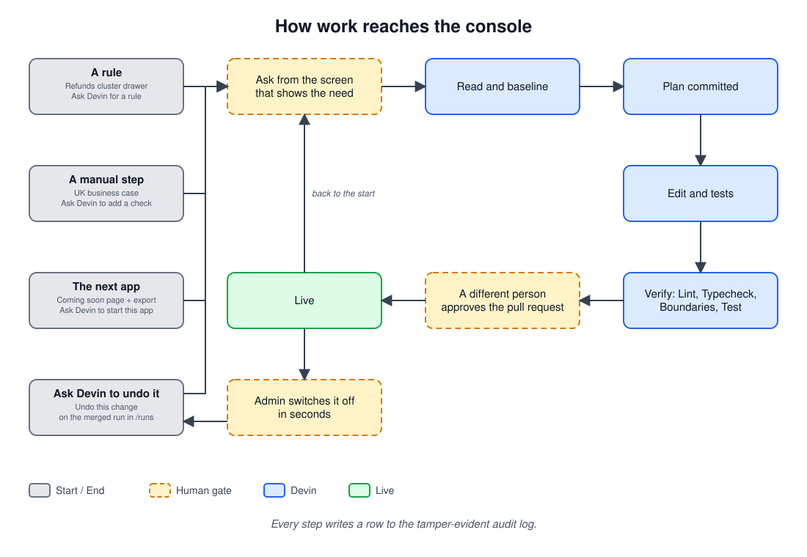

# buy-v-build-cog-demo

Internal operations console demo. 

## Setup

Requires Node 24 and pnpm. The console runs on localhost against a local SQLite file
(`apps/console/data/console.db`). The only outside service is Devin, and only when a key is set.

```bash
git clone https://github.com/rmtandon1/buy-v-build-cog-demo.git
cd buy-v-build-cog-demo
pnpm install
pnpm db:setup   # migrate + seed apps/console/data/console.db
pnpm dev        # serves http://localhost:3001 and opens a browser
```

### Devin key

Devin needs one variable. Put it in a `.env` file at the repository root; `.env` is
gitignored, and the key is read on the server only.

```bash
cp .env.example .env   # then set DEVIN_API_KEY=cog_…
```

The organisation comes from the key (`GET /v3/self`), and the run playbook is found by its
title, so `DEVIN_ORG_ID` and `DEVIN_PLAYBOOK_ID` are optional overrides. `GITHUB_TOKEN` is
needed only for **Review and approve** and the merge check. `GET /api/devin/status` reports
the mode, the organisation and whether the key works; it never returns the key.

**Devin not connected.** Without `DEVIN_API_KEY` the console still runs. The Devin window and
the "Ask Devin for a rule" button say `Devin not connected`, and dispatch is refused — nothing is sent and nothing is written to
`devin_runs` or the audit chain.

`pnpm dev` fails to render until `pnpm db:setup` has created the database. To start over at
any point, delete the data folder and re-seed:

```bash
rm -rf apps/console/data && pnpm db:setup
```

Role switching is a signed cookie (no auth), chosen from the header's "Viewing as"
switcher, which offers five demo roles: `refunds_manager`, `refunds_agent`,
`kyc_reviewer`, `admin` and `engineer`. A sixth role, `kyc_manager`, exists in the
engine (and tests) but is not a switchable lens. Roles are domain-scoped and still
enforced server-side: a refunds agent who posts a kyc action is rejected by the
engine, not by the UI.

## Where to look

| Route | |
| --- | --- |
| `/` | console home: queue counts, pending approvals, recent audit, all modes |
| `/t/kyc`, `/t/refunds`, `/t/flags` | the three live tools — filter, sort, page, open a record |
| `/t/<tool>/<id>` | record detail, masked PII, action panel with the live policy outcome |
| `/inbox` | approval inbox (managers / admin) |
| `/audit` | audit stream with filters, policy traces and before/after |
| `/admin/policy` | runtime policy constants (admin) |
| `/roadmap/<mode>` | the modes not built yet |
| `/runs`, `/t/automation/<id>` | Devin runs and each run's view |
| `/api/devin/status` | Devin mode (`live`, or `simulation` when no key is set and Devin is not connected), organisation and key check |

## Apps

Every mode the console lists, grouped by area. Live apps are backed by a registered
tool in `apps/console/src/registry.ts`; the rest open a roadmap preview.

| App | What it does | Status |
| --- | --- | --- |
| **Compliance** | | |
| KYC review | Approve or reject new customers after their identity checks. | Live |
| Transaction monitoring | Review suspicious-activity alerts and escalate the real ones. | Coming soon |
| Sanctions screening | Clear or confirm matches against sanctions lists. | Coming soon |
| SAR filing | Draft, review and file suspicious activity reports. | Coming soon |
| Business onboarding | Check and approve new business customers. | Coming soon |
| **Money movement** | | |
| Refunds | Pay or reject customer refund requests. | Live |
| Wire release | Release or hold large outgoing payments, with two sign-offs. | Coming soon |
| Chargebacks | Accept or fight card disputes before the deadline. | Coming soon |
| Remittances | Fix and retry stuck international transfers. | Coming soon |
| Ledger adjustments | Post manual credits and write-offs. | Coming soon |
| Reconciliation | Match ledger entries that don't agree with bank settlements. | Coming soon |
| **Customers** | | |
| Card operations | Freeze, replace and set limits on customer cards. | Coming soon |
| Offboarding | Close accounts and return what's left in them. | Coming soon |
| Complaints | Answer customer complaints within the regulator's deadlines. | Coming soon |
| Data requests | Handle customers' requests to see or delete their data. | Coming soon |
| Plans | Manage customer plans and what each one includes. | Coming soon |
| Collections | Set up payment plans for customers who are behind. | Coming soon |
| **Platform** | | |
| Feature flags | Switch features on or off, and choose who sees them. | Live |
| Rule changes | Rules Devin writes, reviewed by an engineer before they go live. | Live |
| Pricing | Change fees, FX spreads and interest rates. | Coming soon |
| Model overrides | Approve risk model updates and manual score overrides. | Coming soon |

## How work reaches the console



Editable source: [`docs/rule-change-workflow.excalidraw`](docs/rule-change-workflow.excalidraw).

## Demo walkthrough

Each flow takes a minute and exercises a different part of the write path.

**Approval, as agent then manager.** As `refunds_agent`, open `/t/refunds`, pick a large
pending payment and request a refund above the auto-approve threshold. The action panel
shows the policy trace and returns "pending approval" instead of applying. Switch to
`refunds_manager`, open `/inbox`, approve it: the frozen payload is executed, the refund settles,
and two audit rows appear. A `kyc_manager` cannot decide it — approvals are scoped to
the tool's domain. A manager cannot approve their own request — the self-approval
block is in the SQL predicate, not the UI.

**Policy that moves.** As `admin`, open `/admin/policy` and lower
`refunds.manager_approval_usd_minor`. Re-run the same refund as `refunds_agent`: the same input now
takes a different branch, because thresholds are read fresh on every decision.

**Masked PII.** Open any case in `/t/kyc`. The document number renders as `•••• 1234` for
every role, and the audit detail masks it too. Only a `kyc_manager` or `admin` can reveal it;
doing so shows the value and writes a `pii_revealed` audit row.

**Kill switch.** As any manager (`kyc_manager`, `refunds_manager` or `admin`), disable a
production flag in `/t/flags` — it applies immediately. Enabling one, or raising its
customer-facing rollout, needs another manager's approval.

## Scripts

| Script | |
| --- | --- |
| `pnpm db:setup` | `db:migrate` then `db:seed` (not `pnpm setup`, which pnpm reserves for its own shell setup) |
| `pnpm db:generate` | regenerate migrations from `apps/console/src/schema.ts` |
| `pnpm db:scenario courier-outage` | insert 60 `not_received` Fernhill Home refunds and submit each through `executeIntent` as the refunds agent; idempotent, local only. Today every refund applies; once the clustering hold merges most go to the manager inbox |
| `pnpm test` | engine and tool tests |
| `pnpm check:boundaries` | engine must not name a tool; no relative imports across packages; only the engine may depend on `db-write` |
| `pnpm check:run` | check run PR diffs against the committed context and plan; no-op on ordinary PRs |
| `pnpm devin:playbook` | create or update the org run playbook from `.devin/run-protocol.playbook.md`, using `DEVIN_API_KEY` from `.env`; dispatch finds it by title |
| `pnpm verify` | lint + typecheck + boundaries + run guard + tests |
| `pnpm build` | production build |

CI (`.github/workflows/verify.yml`, job `verify`) runs `pnpm verify` on every PR to `cognition-dashboard-devin-integration`.

## Layout

pnpm workspace. Each folder is a package; a package can only import what its
`package.json` lists, so the dependency direction below is enforced by the
package manager (see `docs/MIGRATION.md` for the old `src/` → new path map).

```
apps/console/          the Next app: routes, server actions, tool registry, migrations, tests
tools/{kyc,refunds,flags}/  one tool declaration per package (index, schema, seed)
packages/engine/       executeIntent, policy, approvals, idempotency, audit, pii
packages/permissions/  the role catalog
packages/ui/           shadcn primitives + presentational views
packages/db/           read client
packages/db-write/     write handle — only packages/engine depends on it
packages/db-core/      the SQLite connection + engine tables
```
