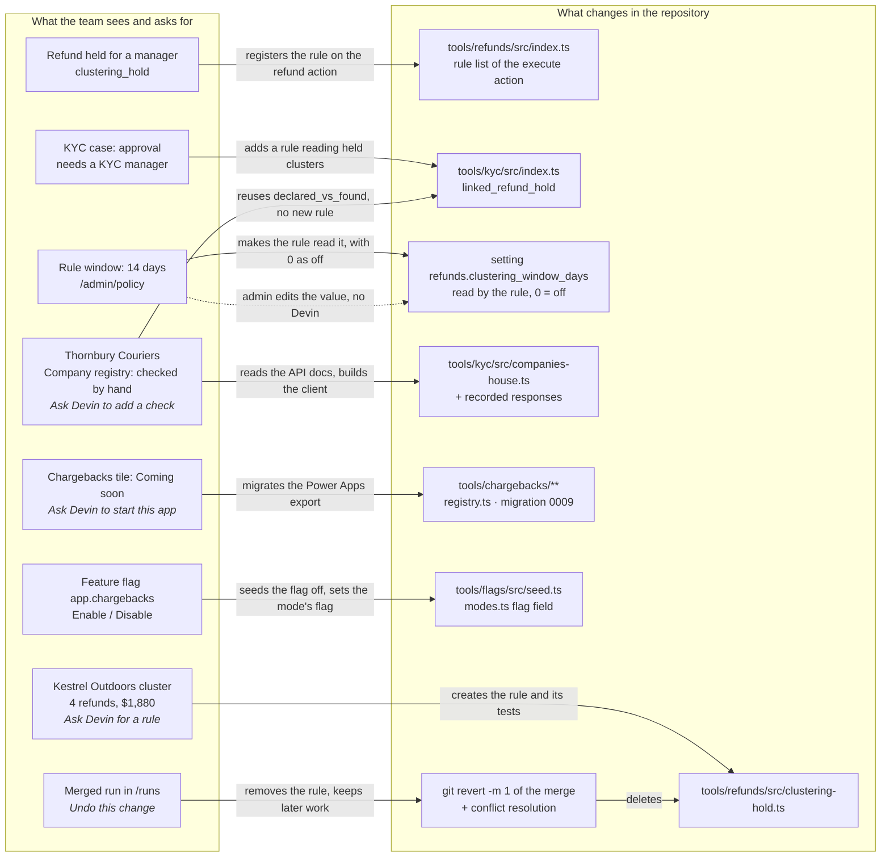

# Architecture: From one sentence to reviewed code

```
┌─────────────────┐ ┌─────────────────┐ ┌─────────────────┐ ┌─────────────────┐ ┌─────────────────┐
│ Refunds split   │ │ A rule that     │ │ A rule no       │ │ A check done    │ │ An app still in │
│ under a limit   │ │ misfires        │ │ longer needed   │ │ by hand         │ │ Power Apps      │
│                 │ │                 │ │                 │ │                 │ │                 │
│ /t/refunds      │ │ /admin/policy   │ │ /runs           │ │ /t/kyc/<id>     │ │ /roadmap/<app>  │
└────────┬────────┘ └────────┬────────┘ └────────┬────────┘ └────────┬────────┘ └────────┬────────┘
         ▼                   ▼                   ▼                   ▼                   ▼
┌──────────────────┬───────────────────┬───────────────────┬───────────────────┬──────────────────┐
│       ADD        │    SWITCH OFF     │      REMOVE       │     AUTOMATE      │      MIGRATE     │
└────────┬─────────┴─────────┬─────────┴─────────┬─────────┴─────────┬─────────┴─────────┬────────┘
         └───────────────────┴───────────────────┼───────────────────┴───────────────────┘
                                                 ▼
                      ┌─────────────────────────────────────────────────────┐
                      │                    Governed write                   │
                      │     Role check, policy check and audit log entry    │
                      └─────────┬─────────────────────────────────┬─────────┘
                    SWITCH OFF  │                                 │ ADD, REMOVE,
                                │                                 │ AUTOMATE, MIGRATE
                                ▼                                 ▼
                  ┌───────────────────────────┐ ┌───────────────────────────────────┐
                  │ Policy setting changed    │ │ 1  Context captured, no PII       │
                  │                           │ │ 2  Devin session opened           │
                  │ Applies from the next     │ │ 3  Plan committed first           │
                  │ decision. No code         │ │ 4  Code and tests written         │
                  │ change, no deploy.        │ │ 5  CI checks pass                 │
                  │                           │ │ 6  Engineer approves              │
                  │                           │ │ 7  Merge, sync; rebuild in prod   │
                  └─────────────┬─────────────┘ └─────────────────┬─────────────────┘
                                └────────────────┬────────────────┘
                                                 ▼
                      ┌─────────────────────────────────────────────────────┐
                      │          New behaviour live in the console,         │
                      │              recorded in one audit log              │
                      └─────────────────────────────────────────────────────┘
```

| Operation | Starts from | Example | Approval |
|---|---|---|---|
| **Add** a rule | **Ask Devin for a rule** in the refunds cluster drawer | Hold a merchant's refunds once together they pass the manager limit | Engineer |
| **Switch off** a rule | The rule's setting on `/admin/policy` | Set `refunds.clustering_window_days` to 0 during a courier outage | Admin only |
| **Remove** a rule | **Undo this change** on a merged run in `/runs` | Take the refund hold out of the code, keeping later work | Engineer |
| **Automate** a check | **Ask Devin to add a check** on a KYC case | Look up UK businesses on Companies House from the case | Engineer |
| **Migrate** an app | **Ask Devin to start this app** on its Coming soon page | Move Chargebacks from Power Apps into the console | Engineer and engine owner |

## The three-layer system

```
      Operations staff  ·  Managers  ·  Admins  ·  Engineers
                            │
                            ▼
┌───────────────────────────┴───────────────────────────┐        ┌──────────────────────────┐
│ 1  CONSOLE                                            │ run    │ DEVIN                    │
│    Queues · Records · Approvals · Policy · Runs       ├───────▶│ Writes the change in     │
│    Next.js application                                │        │ a governed session       │
│                                                       │        │                          │
└─────────────┬───────────────────────────┬─────────────┘        └────────────┬─────────────┘
              │ request                   ▲ result and policy trace           │ pull request
              ▼                           │                                   ▼
┌─────────────┴───────────────────────────┴─────────────┐        ┌────────────┴─────────────┐
│ 2  ENGINE                                             │        │ GITHUB                   │
│    validate → idempotency → policy → approval →       │        │ CI checks and            │
│    effect → audit                                     │        │ engineer approval        │
│    SQLite database                                    │        │                          │
└───────────────────────────┬───────────────────────────┘        └────────────┬─────────────┘
                            ▲ merged code, migrations, new settings           │
                            │                                                 │ merge
┌───────────────────────────┴───────────────────────────┐                     │
│ 3  SOURCE CODE                                        │                     │
│    Tool rules · Registry · Tests · Run records        │                     │
│    Git repository                                     │◀────────────────────┘
│                                                       │
└───────────────────────────────────────────────────────┘
```

| Layer | Responsibility | Location |
|---|---|---|
| **1 Console** | Queues, record views, the approval inbox, policy settings, runs and the Devin window | `apps/console` |
| **2 Engine** | The only path that writes data. Checks roles and policy, holds approvals, masks personal data and keeps the audit log | `packages/engine`, `packages/db-*` |
| **3 Source code** | Each tool's rules, actions, settings and tests, plus a record of every run | `tools/*`, `apps/console/src/registry.ts`, `runs/` |

Two rules keep the layers separate:

- **The engine names no tool.** The engine runs whatever rules a tool declares. A new app is a
  new folder under `tools/` and one line in the registry. `pnpm check:boundaries` fails the
  build if a tool name appears in the engine.
- **Code reaches production only through a reviewed merge.** Devin never writes to the live
  database. After a merge, the console pulls the code, migrates its own database and loads any
  new settings. A production build must then be rebuilt to serve the new code.

### The governed write

Every write, whether a refund, a KYC decision, a flag change or a Devin request, runs the same
six steps. Steps two to six share one database transaction, so an error at any point rolls back
the whole request.

```
 Request ──▶ Validate ──▶ Idempotency ──▶ Policy ──▶ Approval ──▶ Effect ──▶ Audit
                 │             │             │           │
                 ▼             ▼             ▼           ▼
             Rejected      Replayed       Denied     Held for
            no write      or refused      audited   an approver
                          └──────────────────────────────────────────────────────┘
                                        one database transaction
```

Every app inherits seven controls from this path: role access, a policy check on every action,
approvals, live settings, idempotency, masked personal data and the audit log. The approval
query excludes the requester, so nobody can approve their own request.

### Roles and responsibilities

| Party | Responsible for | Cannot |
|---|---|---|
| **Console** | Showing each queue and its evidence, and sending requests to the engine and to Devin | Write data except through the engine |
| **Engine** | Deciding every write, and recording it in the audit log | Call Devin or GitHub |
| **Devin** | Planning, writing and testing each change, opening the pull request, and merging once approved | Read the live database, or merge without approval |
| **GitHub** | Running CI on every pull request and enforcing branch protection | Let Devin bypass review |
| **Engineer** | Reviewing each pull request against its plan and acceptance checklist | Approve a change they requested |
| **Managers and admins** | Requesting changes, approving operational decisions and switching rules off | Approve their own requests |

## Tech stack

| Area | Technology |
|---|---|
| Runtime | Node 24, pnpm workspace |
| Web application | Next.js 15 (App Router, server actions), React 19 |
| Interface | Tailwind CSS 4, shadcn/ui on Radix primitives |
| Database | SQLite with better-sqlite3, Drizzle ORM and drizzle-kit migrations |
| Validation | Zod schemas on every action input |
| Audit | Hash-chained log: each entry stores the SHA-256 of the one before |
| Testing | Vitest, 288 tests |
| Quality checks | ESLint, TypeScript, boundary checks, run guard |
| CI | GitHub Actions (`.github/workflows/verify.yml`) |
| Automation | Devin v3 API with a registered playbook |

| Package | Responsibility | Depends on |
|---|---|---|
| `apps/console` | Routes, server actions, tool registry, migrations, tests | Tools, engine, UI, permissions |
| `tools/kyc`, `tools/refunds`, `tools/flags` | One operations app each: schema, rules, actions, seed data | Engine |
| `tools/automation` | Devin runs: requests, sessions, pull requests, merges | Engine |
| `packages/engine` | The governed write, policy, approvals, audit, masked data | Database packages |
| `packages/permissions` | Roles and what each may do | None |
| `packages/ui` | Shared interface components | None |
| `packages/db`, `db-write`, `db-core` | Read access, write access and the SQLite connection. Only the engine may write | None |

## Integrations

```
 Browser ──▶ Console server ──┬──▶ Devin API (v3) ....... start, poll, message and stop runs
                              ├──▶ GitHub REST API ...... PR status, checks, approving review
                              └──▶ Git and pnpm ......... pull merged code, migrate the database
```

| Service | Used for | Configuration |
|---|---|---|
| **Devin v3 API** | Starting, monitoring, messaging and stopping runs | `DEVIN_API_KEY` |
| **GitHub REST API** | Reading pull request status and checks, and posting the engineer's approval | `GITHUB_TOKEN` |
| **GitHub Actions** | Running `pnpm verify` on every pull request | `.github/workflows/verify.yml` |
| **Git and pnpm** | Pulling merged code and migrating the local database | Local checkout |

All calls to outside services are made from the server. Keys are read from a `.env` file that
is never committed and never sent to the browser. Without a Devin key the console runs normally
and shows Devin as not connected.

## From screen to code

Operators ask in the words on their screen. Devin works out where that lives in the code. Each
edge says what Devin (or, for settings, the admin) does to get from one side to the other.



The same map, as a table:

| On screen | In code | Who changes it |
|---|---|---|
| A cluster the rules don't catch | A new rule file, one line on the refund action, tests | Devin, engineer approves |
| A rule's on/off value | A setting row in the database that the rule reads | Admin, in seconds |
| A check done by hand | A client under `tools/kyc/`, recorded responses, a KYC action | Devin, engineer approves |
| A Coming soon tile | A new `tools/<app>/` package, one registry line, a migration | Devin, engineer and engine owner approve |
| An app's on/off switch | A flag row in `tools/flags/src/seed.ts`, toggled in Feature flags | Devin seeds it, a manager toggles it |
| Undo on a merged run | A revert of that merge, resolved against later work | Devin, engineer approves |

## Workflows

### Add a rule

The same flow applies to automating a check and migrating an app.

```
 REQUESTER        CONSOLE                   DEVIN                 GITHUB            ENGINEER
 ─────────        ───────                   ─────                 ──────            ────────
 Describes the ─▶ Records the request
 rule in one      Captures context
 sentence         Opens a session ────────▶ Reads the code
                                            Commits a plan
                                            Writes code and tests
                                            Opens a PR ─────────▶ Runs CI checks
                  Records the PR ◀───────── Reports the PR
                                                                                    Reviews the PR
                  Checks CI and ◀────────────────────────────────────────────────── Approves
                  context, then ────────────────────────────────▶ Review posted
                  asks Devin to merge ────▶ Merges ─────────────▶ Merged
                  Pulls, migrates and
                  loads new settings
 Next request  ◀─ New rule applies
 follows the rule
```

### Switch a rule off

A rule can read a setting that turns it off. The refund clustering hold does: a window of 0 days
disables it. Changing that setting takes seconds and needs no engineer.

```
 ADMIN                    CONSOLE                         RESULT
 ─────                    ───────                         ──────
 Sets the rule's ───────▶ Updates the setting ──────────▶ The rule reads its off value
 off value                Writes an audit entry           and allows. Code unchanged.
```

Restoring the setting turns the rule back on.

### Remove a rule

Removing a rule is not a plain `git revert`. Other changes may have touched the same files since
the rule merged. Devin removes the rule and keeps everything merged after it.

```
 ADMIN             CONSOLE                  DEVIN                             ENGINEER
 ─────             ───────                  ─────                             ────────
 Requests an ────▶ Records the request
 undo              Opens a session ───────▶ Reverts the original merge
                                            Resolves conflicts, keeping
                                            later changes
                                            Removes the rule, its setting
                                            and its tests
                                            Lists manual follow-ups
                                            Opens a pull request ───────────▶ Reviews and
                                                                              approves
                   Records the merge ◀───── Merges
                   Rule no longer runs
```

The pull request lists what code cannot undo, such as requests the rule is still holding. A
person clears these after the merge.

## Automation

Each Devin run moves through fixed phases. Every phase must pass for the run to continue.
States marked ■ are written to the audit log. States marked ○ are read from Devin as the run
progresses.

```
 Request
     │
     ▼
 Dispatch rules ── fail ──▶ Refused. Nothing is written.
     │ pass
     ▼
 ■ Dispatched ──▶ ■ Session started ── no session ──▶ ■ Dispatch failed
                       │
   ┌───────────────────┘
   ▼
 ○ Intake ──▶ ○ Baseline ──▶ ○ Plan ──▶ ○ Edit ──▶ ○ Verify ──▶ ○ Pull request
   │            │              │          │          │            │
   └────────────┴───────────┬──┴──────────┴──────────┘            ▼
                            │ failure or stop                   ■ PR open
                            ▼                                     │
                          ■ Stopped                               ▼
                                                                ■ Approved
                                                                  │
                                                                  ▼
                                                                ■ Merged
```

| Phase | Passes when |
|---|---|
| Intake | The request is valid and starts from the current code |
| Baseline | All checks pass before any change |
| Plan | Devin commits its list of files to change before editing any of them |
| Edit | Only planned files change |
| Verify | Lint, type checks, boundary checks and all tests pass, with no fewer tests than before |
| Pull request | A pull request is open for review |
| Merge | An engineer who did not request the change has approved it |

Five checks hold each change to its plan. The first four run in CI. The console runs the fifth
when the engineer approves.

| Check | Fails when |
|---|---|
| Stays in plan | A file outside the plan changes |
| Plan stays in scope | The plan includes a file the request does not allow |
| Run record frozen | The committed request or plan changes after the first commit |
| Engine untouched | A rule change modifies the engine or the database schema |
| Context untouched | The request on the branch differs from the one the console sent |

Each run writes five audit entries: requested, session started, pull request opened, approved
and merged.

## Interface states

### From request to live rule

Four screens take a request to a live rule. Each arrow shows the action that moves to the next
screen, and which layers it passes between.

```
┌─ Request ──────────────┐                  ┌─ Run progress ─────────┐
│ "Once a merchant's…"   │  Start run       │ ✓ Plan    ✓ Edit       │
│ Context · Scope        │ ───────────────▶ │ ● Verify               │
│        [ Start run ]   │  Console → Devin │ ○ Pull request         │
└────────────────────────┘                  └────────────┬───────────┘
                                                         │ Pull request opened
                                                         │ Devin → GitHub
                                                         ▼
┌─ Refund ───────────────┐                  ┌─ Approve pull request ─┐
│ Pending manager        │  Merged, synced  │ CI checks   4 of 4 ✓   │
│ approval               │ ◀─────────────── │ Checklist   8 of 8 ✓   │
│ clustering_hold   hold │  Code → Engine   │         [ Approve ]    │
└────────────────────────┘                  └────────────────────────┘
```

### Requesting a change

The request panel shows exactly what Devin receives. Once the run starts, the same panel shows
its progress.

```
┌───────────────────────────────────────┐    ┌───────────────────────────────────────┐
│ Devin · New rule                      │    │ Devin · New rule · Verifying          │
├───────────────────────────────────────┤    ├───────────────────────────────────────┤
│ REQUEST                               │    │ ✓ Intake             base 1a67f60     │
│ Once a merchant's "not received"      │    │ ✓ Baseline           288 tests        │
│ refunds add up past the manager       │    │ ✓ Plan committed     5 files          │
│ limit, send them to a manager.        │ ──▶│ ✓ Edit               +146 −3          │
│                                       │    │ ● Verify                              │
│ CONTEXT                               │    │     Lint ✓  Typecheck ✓               │
│ Kestrel Outdoors · 4 refunds          │    │     Boundaries ✓  Test …              │
│ Manager limit $500 · no PII           │    │ ○ Pull request                        │
│                                       │    │                                       │
│ SCOPE                                 │    │ PLAN                                  │
│ tools/refunds · tools/kyc · tests     │    │ create  refunds/clustering-hold.ts    │
│                                       │    │ modify  refunds/index.ts, kyc/index.ts│
│                        [ Start run ]  │    │                                       │
└───────────────────────────────────────┘    └───────────────────────────────────────┘
```

### Approving a change

Only an engineer who did not request the change can approve it.

```
┌───────────────────────────────────────┐    ┌───────────────────────────────────────┐
│ Approve pull request                  │    │ Approve pull request                  │
├───────────────────────────────────────┤    ├───────────────────────────────────────┤
│ 5 files · +146 −3                     │    │ ✓  Review posted to GitHub            │
│ CI checks  4 of 4 passed ✓            │    │ ✓  Devin merged the PR                │
│ Context    unchanged ✓                │ ──▶│ ✓  Merged code pulled                 │
│ Checklist  8 of 8 ticked ✓            │    │ ✓  Audit entry written                │
│                                       │    │                                       │
│            [ Cancel ]  [ Approve ]    │    │                         [ Close ]     │
└───────────────────────────────────────┘    └───────────────────────────────────────┘
```

### The same action, before and after

A refunds agent sends the same kind of refund to the processor. After the rule merges, the
policy trace shows the new rule and the refund waits for a manager.

```
┌── Before ─────────────────────────────┐    ┌── After ──────────────────────────────┐
│ Refund · Send to processor            │    │ Refund · Send to processor            │
├───────────────────────────────────────┤    ├───────────────────────────────────────┤
│ Settled                               │    │ Pending manager approval              │
│                                       │    │                                       │
│ within_captured_amount   allow        │    │ within_captured_amount   allow        │
│ not_disputed             allow        │    │ not_disputed             allow        │
│ amount_approval          allow        │    │ amount_approval          allow        │
│ goodwill_approval        allow        │    │ goodwill_approval        allow        │
│                                       │    │ clustering_hold          hold         │
│                                       │    │   Kestrel $1,880 over $500 in 14 days │
└───────────────────────────────────────┘    └───────────────────────────────────────┘
```

## Rule lifecycle

A live rule and a switched-off rule run the same code. Only a removal takes the rule out of the
code.

```
 ┌────────┐           ┌───────────┐                  ┌────────┐                  ┌────────┐
 │ Absent │──────────▶│ In review │─────────────────▶│  Live  │─────────────────▶│  Off   │
 │        │  request  │           │  approve, merge  │        │◀─────────────────│        │
 └────────┘           └───────────┘                  └───┬────┘  switch off, on  └─────┬──┘
      ▲                                                  │ undo                   undo │
      │               ┌─────────────┐                    ▼                             │
      └───────────────┤ Undo review │◀───────────────────┴─────────────────────────────┘
       approve, merge └─────────────┘
```

### State snapshots

Example: a rule that holds a merchant's refunds once together they pass the $500 manager limit.

```
 STATE         CODE                          SETTING                  NEXT KESTREL REFUND
 ───────────── ────────────────────────────  ───────────────────────  ───────────────────────
 Before        No clustering rule            No window setting        Settles

 Live          clustering_hold on refunds    Window: 14 days          Held for a manager
               linked_refund_hold on KYC                              KYC approval of the
               Tests for both                                         customer needs a
                                                                      KYC manager

 Off           Unchanged                     Window: 0 days           Settles. The rule
                                                                      still runs, and allows

 Removed       Rule, KYC check and tests     Setting left in the      Settles. The rule no
               removed. Later changes to     database, listed as a    longer appears in the
               the same files kept           manual follow-up         policy trace
```

### Restoring a rule

| From | To | How |
|---|---|---|
| Off | Live | Restore the setting on `/admin/policy`. Takes effect immediately |
| Removed | Live | Request the rule again. The original request and plan remain in `runs/` |

Git holds every version of the code, and `runs/<run_id>/` holds each run's request and plan.
No separate backup is needed.

### Timeline

The audit log records every step in a rule's life.

```
    EVENT                               BY                AUDIT ENTRY
    ────────────────────────────────    ────────────────  ──────────────────────
 ●  Rule requested                      Refunds manager   dispatch
 │  Devin session started               Console           record_session
 │  Pull request opened                 Devin             record_pr
 │  Pull request approved               Engineer          approve_pr
 ●  Merged. Rule live                   Devin             record_merge
 │  Refunds held by the rule            Refunds agent     one per refund
 ●  Rule switched off                   Admin             setting changed
 ●  Undo requested                      Admin             dispatch
 │  Pull request opened                 Devin             record_pr
 │  Pull request approved               Engineer          approve_pr
 ●  Merged. Rule removed                Devin             record_merge
```

## Documentation

| Document | Covers |
|---|---|
| [`README.md`](../README.md) | Overview, usage, technical details and troubleshooting |
| [`SETUP.md`](SETUP.md) | Installation and install-time fixes |
| [`CUSTOMER_FRAMING.md`](../CUSTOMER_FRAMING.md) | The problem, stakeholders and scenarios |
| [`DEVIN_RUN_PROTOCOL.md`](DEVIN_RUN_PROTOCOL.md) | Run types, phases, guard checks and reversal |
| [`AGENT_TRIGGER_SURFACE.md`](AGENT_TRIGGER_SURFACE.md) | Where requests start, and the run and approval screens |
| [`DEVIN-NO-DEVIN.md`](DEVIN-NO-DEVIN.md) | Which changes need Devin and which are settings |
| [`REFUND_CLUSTERING_HOLD.md`](REFUND_CLUSTERING_HOLD.md) | Specification: refund clustering hold |
| [`COMPANIES_HOUSE_CHECK.md`](COMPANIES_HOUSE_CHECK.md) | Specification: Companies House check |
| [`CHARGEBACKS_FROM_POWER_APPS.md`](CHARGEBACKS_FROM_POWER_APPS.md) | Specification: Chargebacks migration |
